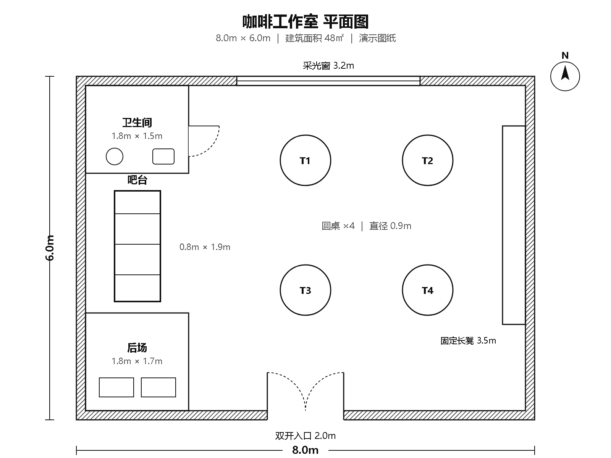
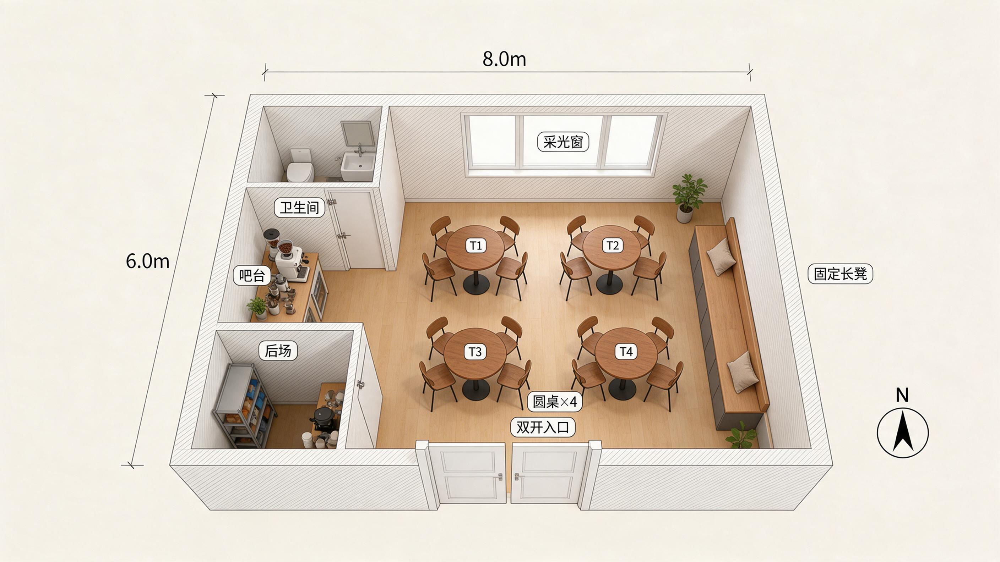

# 48㎡咖啡工作室：2D→3D单次实测对照

> 单次概念演示 · 自有演示图纸 · 非客户案例 · 非施工设计

本页并排展示一张 8m × 6m、48㎡咖啡工作室二维演示平面图，以及 2026-09-13 通过 Coze 技能生成的一张历史概念输出。输入图是自有演示素材，不来自客户现场；输出图是 AI 概念示意，需要人工核对，不能代替施工设计、现场测量或专业审查。

## 输入：二维平面图

图中标注了 4 张圆桌、西墙开放吧台、西北卫生间、西南后场、北侧采光窗、东侧固定长凳和南侧双开入口。

## 单次输出：三维概念图

该图来自 2026-09-13 的历史 Coze 调用留存。对应测试记录对该张主图按 9 项清单做过人工核对，并将其记为通过。这里只展示这一个结果，不代表每次生成都能达到相同效果。

## 复测边界

- 历史记录为同一输入重复 4 次：其中这张是唯一一次干净通过；其他结果有瑕疵或未通过。这只是该组有限样本的记录，不据此推算一般成功率，也不构成稳定性承诺。
- 这是单个 2D 输入与一个 3D 技能历史输出的对照，不是“工厂布局技能先出 2D、再由 3D 技能接续”的双技能串联实跑。
- 图片用于概念讨论。尺寸、开口、方位、功能区、通道及现场条件都需要人工核对；不是施工图、消防图或结构图。
- 本页仅发布两张示例图和说明，不包含底层付费 Skill 源码、调用配置或本地测试记录。

## 相关入口

- [查看 Coze「2D平面转3D效果图」技能商品](https://www.coze.cn/skills?skill_share_pid=7640904637083664434)
- [了解布局人工协助范围并提交需求](https://www.angetlean.com/layout/)

商品是否可购买、当前价格和人工服务是否承接，以各自页面及双方另行确认为准；本案例没有验证购买完成，也没有客户评价或成交声明。
